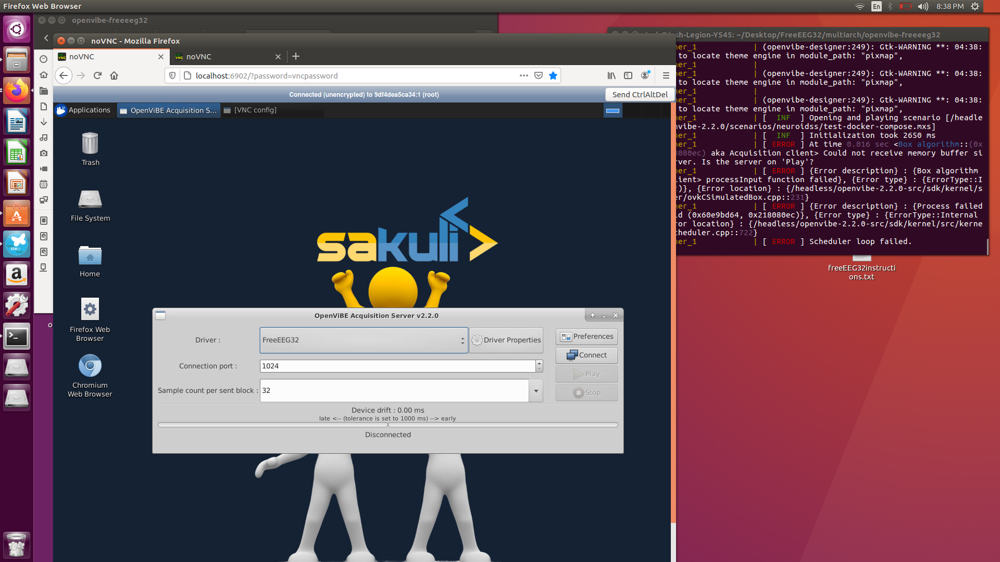
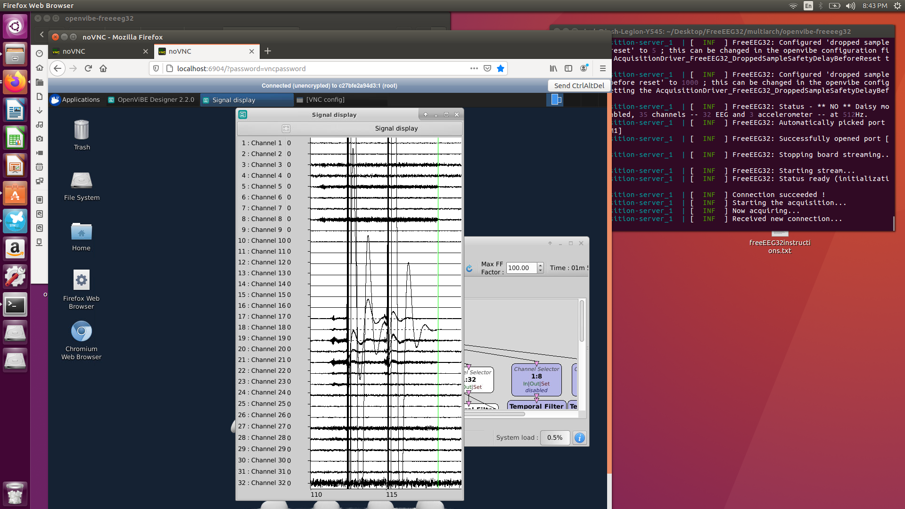
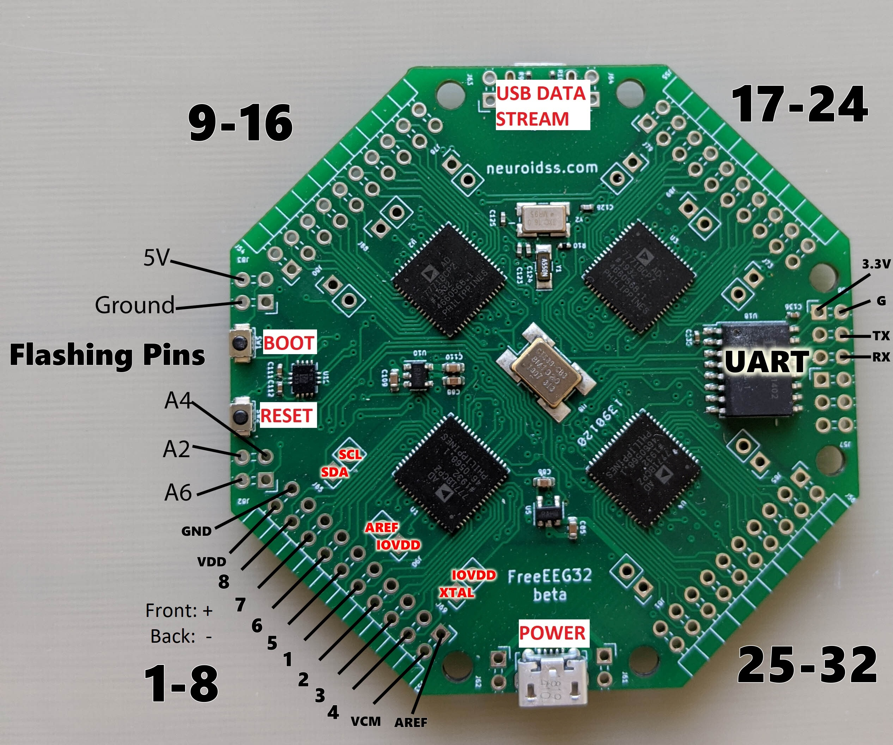
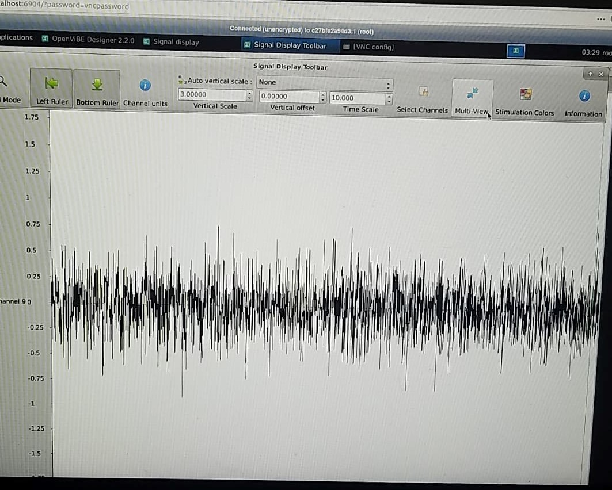
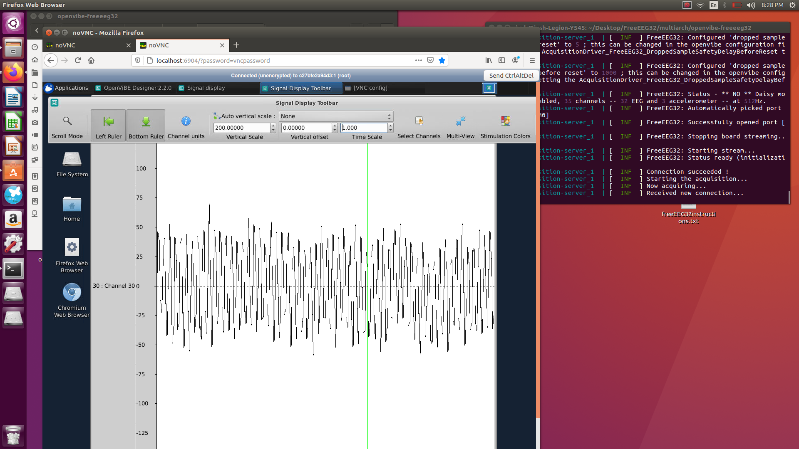
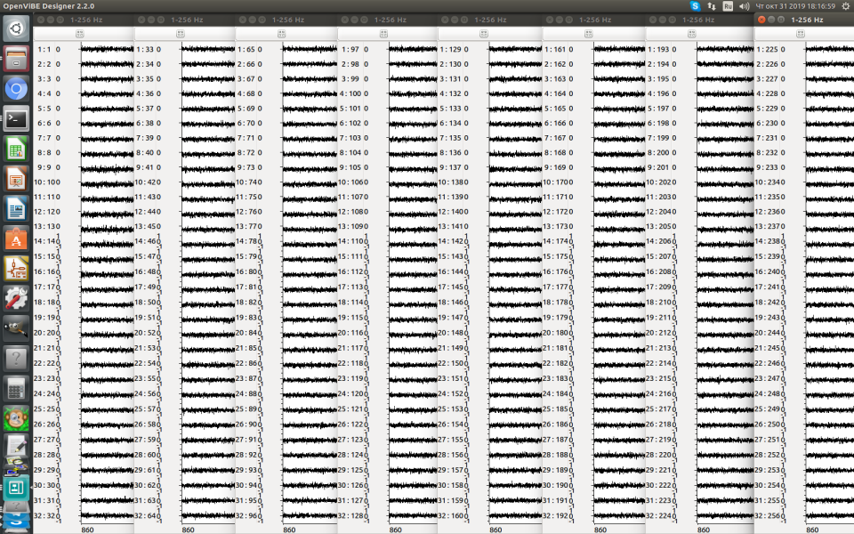

# FreeEEG32 OpenVibe Docker Readme

#### Materials:

FreeEEG32 Board

2x MicroUSB cords

#### Software:

Install on Ubuntu (16.04 or 18.04 preferred)

[Docker](https://docs.docker.com/get-docker/)

[Docker Compose](https://docs.docker.com/compose/install/)


## Setting up OpenVIBE with Docker Compose

With Docker and Docker Compose installed for Ubuntu, in the OpenVIBE folder from this repo, first extract openvibe-freeeeg32.tar.gz to somewhere (the same folder as the .tar.gz file is fine).

Now open this extracted openvibe-freeeeg32 folder and right click and select Open Terminal.

In the Terminal that opens, use the command "sudo docker-compose up" and it will download a bunch of stuff to create a Docker container with OpenVIBE running.

Once it finishes downloading everything you should see some messages with colored text in brackets. That means the Docker Container is now running. 

Press Ctrl+C twice in the Terminal to close the server. Now plug in your EEG with both wires if it's not already, then re-run "sudo docker-compose up" in the same Terminal.

Now open your browser and enter the address
http://localhost:6904/?password=vncpassword


There is also a server interface at http://localhost:6902/?password=vncpassword where you can manually connect, however it should run automatically on default settings.




If the EEG connected successfully, you will see a "Now acquiring..." message in the Terminal and no timeout messages. If you see timeouts, replug the device then rerun the sudo docker-compose up command again.

At http://localhost:6904/?password=vncpassword, you will see the OpenVIBE welcome dialog. Close the welcome dialog to use the Designer GUI.


Click Run in the GUI and you should see a signal chart come up with all of the channels streaming. If any groups of channels aren't streaming while others are that tells you that one of the ADCs had a failure. You can simply tap on any of the signal inputs with your finger to see electrical response.



## Test the signal!

Click the Signal display tab at the top to bring up the menu for the charts. You can select a single channel and shorten the time interval up to see a close up view of signal quality.



Short a + (front) and - (back) analog input together on a single channel and ensure that the noise being measured is less than 0.25uV on average. 
The graph scale is in Microvolts (uV). Select that channel in the signal view and scale it to around 2.00 uV or just select automatic scaling.



If that looks good enough, now wire up 3 electrodes like so, 2 for a single channel + and - slots and 1 in the Gnd position:


For an easy test, put the Gnd electrode on your ear (use tape or something to stick it there if you don't have a clip).
Put the + and - electrode on Fp1 and Fp2. Now wiggle your forehead and move your eyes around, you should see responses with the EEG amplitudes at around 100uV or less. 
The wave forms at small scale should look fairly sine wave-like.



Another test is to put the + and - leads on O1 and O2 of your visual cortex, then open and close your eyes to see activations.

And that's it really! Good luck!


### Multiple EEGs

You can run multiple EEGs plugged into your computer (you'll need lots of USB ports!) in the same GUI by starting more servers before starting the GUI. 

That should stream it automatically into OpenVIBE in multiples of 32 channels. Here are 8 plugged into the same PC:



For plugin programming, you just need grab multiple virtual serial port streams or create a similar server interface for remote streaming.

### FreeEEG32 OpenVIBE output format

The FreeEEG32 output format mimics OpenBCI's stacked output which is based on Brain Bay's work, while ours is scaled for 32 channels.
You may also change the output to number strings by opening /Inc/main.h in the source code and changing to this on line 286/287 (just comment one out and uncomment the other)
```
#define FREESMARTEEG_OUT FREESMARTEEG_SAI_TEXT_UART7_INT
//#define FREESMARTEEG_OUT FREESMARTEEG_SAI_OPENVIBE_FREEEEG32_CUSTOM_INT
```

In /Src/main.c, search FREESMARTEEG_SAI_OPENVIBE_FREEEEG32_CUSTOM_INT to see how the data is encoded in OpenBCI/BrainBay format.


